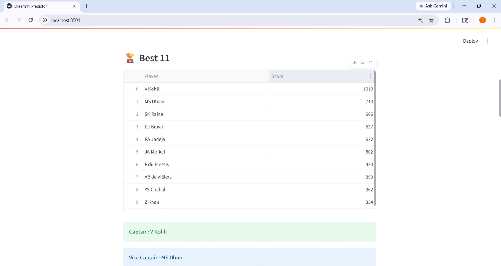
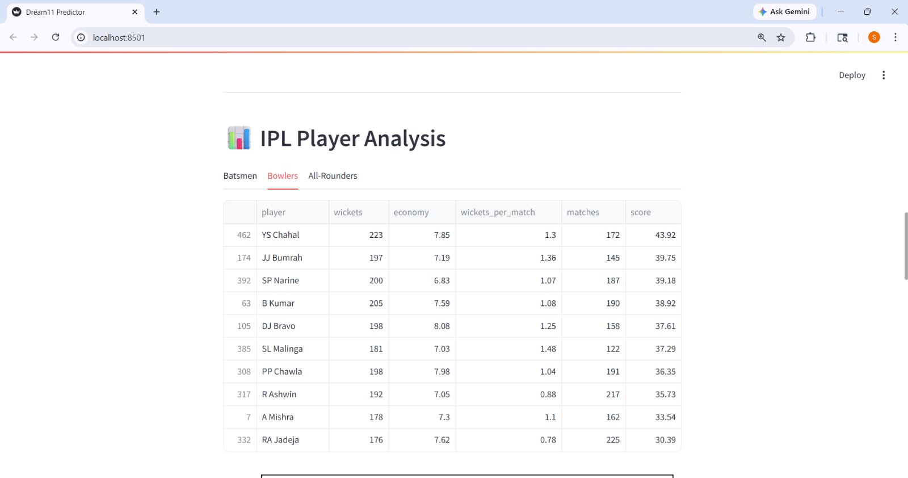
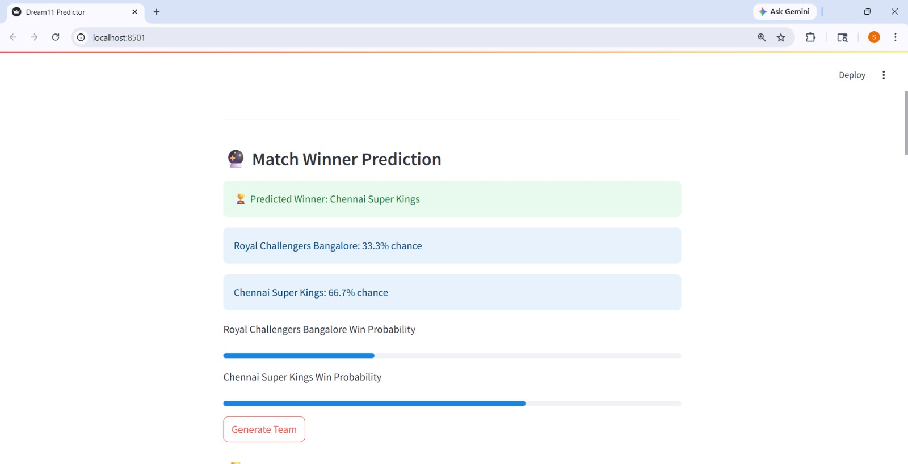
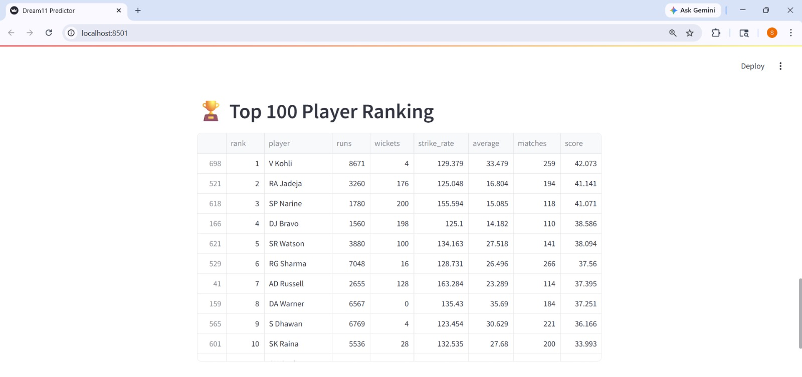

# 🏏 Dream11 IPL Prediction System

# 📌 Project Overview

Dream11 IPL Prediction System is a Streamlit-based web application developed using Python and IPL Ball-by-Ball dataset analysis.  

The project predicts:
- ✅ Best Playing XI
- ✅ Match Winner Prediction
- ✅ Top Batsmen Rankings
- ✅ Top Bowlers Rankings
- ✅ All-Rounder Rankings
- ✅ ICC-Inspired Player Ranking System
- ✅ Team Win Percentage
- ✅ Venue-Based Analysis

This system helps analyze IPL player performance using real match statistics and ranking formulas.

---

# 🚀 Features

✨ Best Dream11 Team Prediction  
✨ IPL Team vs Team Analysis  
✨ Top Batsmen Performance Analysis  
✨ Top Bowlers Performance Analysis  
✨ All-Rounder Performance Analysis  
✨ ICC-Inspired Ranking System  
✨ Match Winner Prediction  
✨ Win Percentage Visualization  
✨ Venue-Based Insights  
✨ Interactive Graphs & Charts  
✨ Streamlit Interactive UI  

---

## 🛠️ Technologies Used

- Python
- Pandas
- NumPy
- Matplotlib
- Streamlit
- Git & GitHub

# 🏏 Dream11 IPL Prediction System

## 🏠 Home Page

---

## 🏆 Best Playing XI

---

## 📊 Analysis

---

## 🎯 Match Winner Prediction

---

## 📈 Ranking System

## Prject Structure
Dream11_IPL_Prediction_System/
│
├── screenshots/
│   ├── home.jpeg
│   ├── Best11.jpeg
│   ├── Analysis.jpeg
│   ├── Match_winner.jpeg
│   ├──Ranking.jpeg
├── app.py
├── analysis.py
├── IPL.csv
└── README.md

## ▶️ Run Project
python -m streamlit run app.py

## Developed By
Sachin Popat Borude

